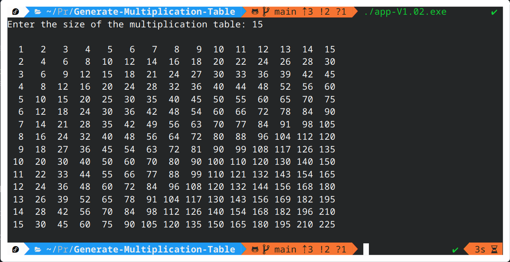

# Generate Multiplication Table

You are asked to create a program that generates a multiplication table for a given size n. The
multiplication table should be formatted as a grid, where each cell contains the product of the
corresponding row and column indices.

- Prompt the user to enter the size of the multiplication table (an integer n).
- Use nested loops to generate the multiplication table.
- Display the multiplication table in a grid format, with each cell properly aligned.

